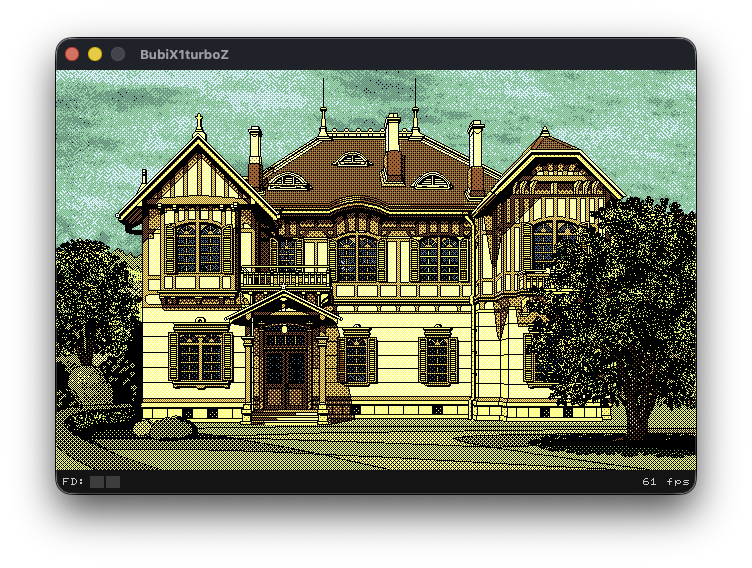

# BubiX1turboZ

<p align="center">
  
</p>

Sharp X1 turbo Zのエミュレーターです。マルチプラットフォームです。


<p align="center">
  <a href="https://github.com/bubio/BubiX1turboZ/releases/latest">
    
  </a>
  <a href="https://github.com/bubio/BubiX1turboZ/blob/main/LICENSE">
    
  </a>
  <a href="https://github.com/bubio/BubiX1turboZ/actions/workflows/build-macos.yml">
    
  </a>
  <a href="https://github.com/bubio/BubiX1turboZ/actions/workflows/build-linux.yml">
    
  </a>
  <a href="https://github.com/bubio/BubiX1turboZ/actions/workflows/build-windows.yml">
    
  </a>
</p>

## BubiX1turboZとは
---
BubiX1turboZは、[Common Source Code Project](https://takeda-toshiya.my.coocan.jp/common/index.html)の`eX1turboZ` をベースにしたSharp X1 turbo Zのマルチプラットフォームエミュレーターです。

<p align="center">
  
</p>

エミュレーションコア（C++）はそのまま活用し、アプリケーション層をNimで書き起こすことでマルチプラットフォーム（macOS / Linux / Windows）に対応しています。

<br />

## インストール方法
---

[リリース](https://github.com/bubio/BubiX1turboZ/releases)からお手持ちの環境にあった実行ファイルをダウンロードしてください。

<br />

### 動作環境

| プラットフォーム | CPU | 最小OSバージョン | 実行ファイル |
| --- | --- | --- | --- |
| macOS | Apple Silicon | macOS 13.5 Ventura以降 | [DMG](https://github.com/bubio/BubiX1turboZ/releases/latest) |
| Linux | amd64 / arm64 | Ubuntu 22.04以降 | [AppImage / .deb / .rpm](https://github.com/bubio/BubiX1turboZ/releases/latest) |
| Windows | x86_64 | Windows 11以降 | [ZIP](https://github.com/bubio/BubiX1turboZ/releases/latest) |

<br />

## ROMファイル
---
起動には以下のROMファイルが必要です。

- `IPLROM.X1T`
- `FNT0808.X1`
- `FNT0816.X1`
- `FNT1616.X1`

<br />

### 配置場所
ROMファイルの配置場所は以下になります（一度、アプリケーションを起動するとフォルダが作成されます）。

**macOS:**
```shell
"~/Library/Application Support/BubiX1turboZ/roms/"
```

**Linux:**
```shell
"~/.local/share/BubiX1turboZ/roms/"
```

**Windows:**
```shell
"%LOCALAPPDATA%\BubiX1turboZ\roms\"
```

<br />

## 使用方法
---

- `Disk -> FD0 / FD1` メニュー、またはウィンドウへのドラッグ＆ドロップでディスクイメージ（`d88` / `d77` / `d8e` / `1dd` / `2d`）やアーカイブ（`7z` / `zip` / `m3u` / `m3u8`）を挿入できます。
- ドラッグ＆ドロップ時は自動でリセットが実行されます。

### 主なショートカット

- `Cmd+R` / `Ctrl+R`: リセット
- `Cmd+V` / `Ctrl+V`: テキストの貼り付け（オートキー）
- `Cmd+S` / `Ctrl+S` / `Cmd+L` / `Ctrl+L`: クイックセーブ / クイックロード
- `Cmd+1` / `Ctrl+1` / `Cmd+2` / `Ctrl+2`: FD0 / FD1 にディスクを挿入
- `Cmd+3` / `Ctrl+3`: FD0/FD1 両方に同じディスクを挿入
- `Cmd+Ctrl+F`: フルスクリーン切り替え

<br />

## ビルド方法
---

いずれのプラットフォームも、Nimのバージョン管理に[mise](https://mise.jdx.dev/)を使います（Windowsのみ後述の専用スクリプトで完結するため不要です）。

### macOS

```shell
mise trust
mise plugins install nim https://github.com/asdf-community/asdf-nim
mise install
mise exec -- nimble install -d -y
./scripts/build_macos.sh --dmg
```

### Linux

```shell
sudo apt install libsdl2-dev libgtk-3-dev zlib1g-dev imagemagick desktop-file-utils rpm
mise trust
mise plugins install nim https://github.com/asdf-community/asdf-nim
mise install
mise exec -- nimble install -d -y
./scripts/build_linux.sh --appimage --deb --rpm
```

### Windows

`.sh`スクリプトはbashで動くため、コマンドプロンプトやPowerShellではなく**Git Bash**（[Git for Windows](https://gitforwindows.org/)に同梱）から実行します。

1. [Git for Windows](https://gitforwindows.org/)をインストールする。
2. スタートメニューから「**Git Bash**」を開き、このリポジトリのフォルダに`cd`する。
3. Git Bash上で以下を実行（Nim・MinGW-w64・SDL2・zlibは`mise`を使わず専用スクリプトで取得します）:

```shell
./scripts/install_nim_windows.sh
./scripts/fetch_mingw_windows.sh
./scripts/fetch_sdl2_windows.sh
./scripts/fetch_zlib_windows.sh

. build/toolchain/nim-windows/env.sh
. build/toolchain/mingw-windows/env.sh
export PATH="$MINGW_BIN_DIR:$PATH"
"$NIM_BIN_DIR/nimble.exe" install -d -y

./scripts/build_windows.sh
```

<br />

## 謝辞
---
素晴らしいエミュレーターコア（eX1turboZ）を公開されている武田 茂樹（Takeda, Toshiya）氏に感謝いたします。

<br />

## 使用しているOSSのライセンス

| Component | License |
| --- | --- |
| [eX1turboZ](https://takeda-toshiya.my.coocan.jp/common/index.html) | GPL-2.0-or-later |
| [SDL2](https://github.com/libsdl-org/SDL) | zlib License |
| [GTK3](https://www.gtk.org/) | LGPL-2.1-or-later |
