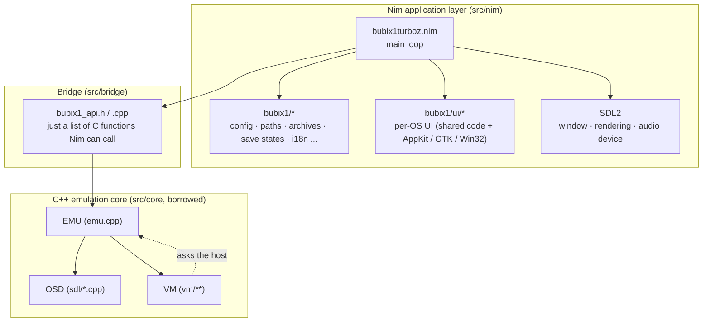
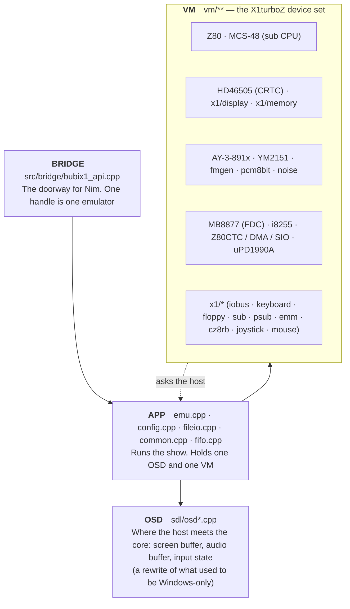
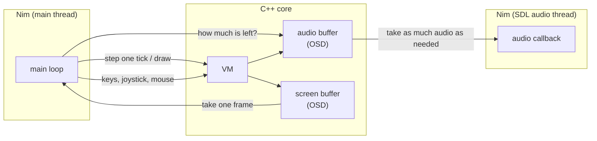
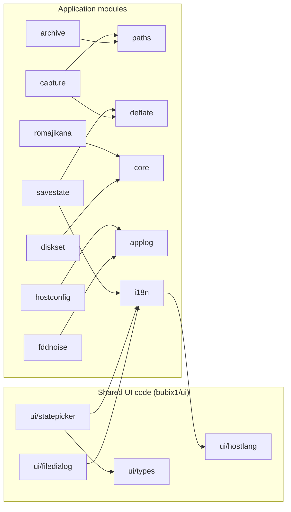
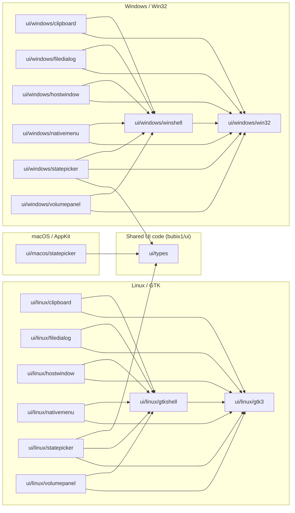

# Architecture

A look at the pieces BubiX1turboZ is built from.

The core-side diagrams are drawn by hand. The C++ core is borrowed from another
project as-is, so we don't generate anything from it. The Nim dependency graphs
are made by `scripts/make_dep_graph.sh`. That's the part inside the markers, so
don't edit it by hand — the next run will wipe it.

For the details of each module, see [`docs/api/`](api/theindex.html).

---

## The whole picture

The emulator comes in three parts.

- **A C++ emulation core** — eX1turboZ from the Common Source Code Project, used more or less untouched
- **A Nim application layer** — the window, the menus, settings, reading and writing files: everything that isn't emulation
- **A bridge between them** — a thin layer that lets Nim call into the C++



One thing is easy to misread. There's a directory called `src/core/sdl/`, but
**there is no SDL in it**. SDL2 is used only on the Nim side. That directory is a
rewrite of what used to be Windows-only code, and the name just looks that way.
The `-D_USE_SDL` build flag is likewise a switch meaning "don't use the Windows
API", not "use SDL".

Only numbers and memory addresses cross between C++ and Nim — no objects, no
complicated types. That keeps the bridge thin and easy to follow.

## How the core is put together

The core is built in four groups; `scripts/build_core.sh` has the list. It all
ends up in a single library, `build/libbubix1core.a`.



When a device inside the VM (the Z80, the FDC, and so on) wants something from
the host — to draw, to make a sound — it doesn't call the OSD itself. It asks
EMU, and EMU passes the request down to the OSD. Only two places in the VM touch
the OSD directly, both in the debugger code.

We leave the core alone as a rule. Where a change is unavoidable it lives in
`patches/` and gets applied by `scripts/apply_core_patches.sh`. Re-fetching the
core from upstream wipes those patches, so remember to re-apply them when you do.

One warning: some of the core's source files have Shift-JIS bytes in their
comments, and macOS `grep` will sometimes skip such a file without saying so. An
empty search result doesn't necessarily mean there's nothing there.

## What passes between the host and the core

The pace of emulation is set by **how much audio is left in the buffer**.

The obvious approach would be to step the VM 60 times a second, but that either
drops audio or runs too fast. Instead, the VM is stepped only while the audio
buffer is below its target. The SDL audio thread drains that buffer in real time,
so the emulation settles at real-time speed on its own.



`bx1_lock` / `bx1_unlock` keep two threads from touching the VM at once. EMU takes
that same lock internally, so it's the kind that the same thread can take twice
(a recursive mutex).

## How the Nim modules connect

The next four diagrams are generated by `scripts/make_dep_graph.sh`. Labels are
module names with the `bubix1/` prefix dropped.

There are 84 arrows in total. Cramming them into one picture makes it unreadable,
so they're split across four.

One more thing. Nim doesn't compile the branch of a `when defined(...)` that
wasn't chosen, so a single run of the graph only shows the backend belonging to
whichever OS produced it. So we build it three times — macOS, Linux, Windows —
and overlay the results. The third diagram shows four backends side by side, but
**only one of them is ever live**.

<!-- BEGIN GENERATED: module-graph -->

### What the main program uses directly

```mermaid
flowchart TD
    bubix1turboz["bubix1turboz"]
  subgraph app["Application modules"]
    bubix1_ankfont["ankfont"]
    bubix1_applog["applog"]
    bubix1_archive["archive"]
    bubix1_capture["capture"]
    bubix1_core["core"]
    bubix1_deflate["deflate"]
    bubix1_diskset["diskset"]
    bubix1_fddnoise["fddnoise"]
    bubix1_hostconfig["hostconfig"]
    bubix1_i18n["i18n"]
    bubix1_keymap["keymap"]
    bubix1_paths["paths"]
    bubix1_recentfiles["recentfiles"]
    bubix1_romajikana["romajikana"]
    bubix1_savestate["savestate"]
  end
  subgraph facade["Shared UI code (bubix1/ui)"]
    bubix1_ui_clipboard["ui/clipboard"]
    bubix1_ui_filedialog["ui/filedialog"]
    bubix1_ui_hostwindow["ui/hostwindow"]
    bubix1_ui_nativemenu["ui/nativemenu"]
    bubix1_ui_statepicker["ui/statepicker"]
    bubix1_ui_volumepanel["ui/volumepanel"]
  end
  bubix1turboz --> bubix1_ankfont
  bubix1turboz --> bubix1_applog
  bubix1turboz --> bubix1_archive
  bubix1turboz --> bubix1_capture
  bubix1turboz --> bubix1_core
  bubix1turboz --> bubix1_deflate
  bubix1turboz --> bubix1_diskset
  bubix1turboz --> bubix1_fddnoise
  bubix1turboz --> bubix1_hostconfig
  bubix1turboz --> bubix1_i18n
  bubix1turboz --> bubix1_keymap
  bubix1turboz --> bubix1_paths
  bubix1turboz --> bubix1_recentfiles
  bubix1turboz --> bubix1_romajikana
  bubix1turboz --> bubix1_savestate
  bubix1turboz --> bubix1_ui_clipboard
  bubix1turboz --> bubix1_ui_filedialog
  bubix1turboz --> bubix1_ui_hostwindow
  bubix1turboz --> bubix1_ui_nativemenu
  bubix1turboz --> bubix1_ui_statepicker
  bubix1turboz --> bubix1_ui_volumepanel
```



### How the modules relate to each other



### How the UI switches from one OS to another

```mermaid
flowchart LR
  subgraph facade["Shared UI code (bubix1/ui)"]
    bubix1_ui_clipboard["ui/clipboard"]
    bubix1_ui_filedialog["ui/filedialog"]
    bubix1_ui_hostlang["ui/hostlang"]
    bubix1_ui_hostwindow["ui/hostwindow"]
    bubix1_ui_nativemenu["ui/nativemenu"]
    bubix1_ui_statepicker["ui/statepicker"]
    bubix1_ui_volumepanel["ui/volumepanel"]
  end
  subgraph macos["macOS / AppKit"]
    bubix1_ui_macos_clipboard["ui/macos/clipboard"]
    bubix1_ui_macos_filedialog["ui/macos/filedialog"]
    bubix1_ui_macos_hostlang["ui/macos/hostlang"]
    bubix1_ui_macos_nativemenu["ui/macos/nativemenu"]
    bubix1_ui_macos_statepicker["ui/macos/statepicker"]
    bubix1_ui_macos_volumepanel["ui/macos/volumepanel"]
  end
  subgraph linux["Linux / GTK"]
    bubix1_ui_linux_clipboard["ui/linux/clipboard"]
    bubix1_ui_linux_filedialog["ui/linux/filedialog"]
    bubix1_ui_linux_hostlang["ui/linux/hostlang"]
    bubix1_ui_linux_hostwindow["ui/linux/hostwindow"]
    bubix1_ui_linux_nativemenu["ui/linux/nativemenu"]
    bubix1_ui_linux_statepicker["ui/linux/statepicker"]
    bubix1_ui_linux_volumepanel["ui/linux/volumepanel"]
  end
  subgraph windows["Windows / Win32"]
    bubix1_ui_windows_clipboard["ui/windows/clipboard"]
    bubix1_ui_windows_filedialog["ui/windows/filedialog"]
    bubix1_ui_windows_hostlang["ui/windows/hostlang"]
    bubix1_ui_windows_hostwindow["ui/windows/hostwindow"]
    bubix1_ui_windows_nativemenu["ui/windows/nativemenu"]
    bubix1_ui_windows_statepicker["ui/windows/statepicker"]
    bubix1_ui_windows_volumepanel["ui/windows/volumepanel"]
  end
  subgraph stub["Stub (for OSes with no implementation yet)"]
    bubix1_ui_stub_hostwindow["ui/stub/hostwindow"]
  end
  bubix1_ui_clipboard --> bubix1_ui_linux_clipboard
  bubix1_ui_clipboard --> bubix1_ui_macos_clipboard
  bubix1_ui_clipboard --> bubix1_ui_windows_clipboard
  bubix1_ui_filedialog --> bubix1_ui_linux_filedialog
  bubix1_ui_filedialog --> bubix1_ui_macos_filedialog
  bubix1_ui_filedialog --> bubix1_ui_windows_filedialog
  bubix1_ui_hostlang --> bubix1_ui_linux_hostlang
  bubix1_ui_hostlang --> bubix1_ui_macos_hostlang
  bubix1_ui_hostlang --> bubix1_ui_windows_hostlang
  bubix1_ui_hostwindow --> bubix1_ui_linux_hostwindow
  bubix1_ui_hostwindow --> bubix1_ui_stub_hostwindow
  bubix1_ui_hostwindow --> bubix1_ui_windows_hostwindow
  bubix1_ui_nativemenu --> bubix1_ui_linux_nativemenu
  bubix1_ui_nativemenu --> bubix1_ui_macos_nativemenu
  bubix1_ui_nativemenu --> bubix1_ui_windows_nativemenu
  bubix1_ui_statepicker --> bubix1_ui_linux_statepicker
  bubix1_ui_statepicker --> bubix1_ui_macos_statepicker
  bubix1_ui_statepicker --> bubix1_ui_windows_statepicker
  bubix1_ui_volumepanel --> bubix1_ui_linux_volumepanel
  bubix1_ui_volumepanel --> bubix1_ui_macos_volumepanel
  bubix1_ui_volumepanel --> bubix1_ui_windows_volumepanel
```



### What each OS's implementation sits on



<!-- END GENERATED: module-graph -->

## Regenerating the diagrams

```
./scripts/make_dep_graph.sh
```

No Graphviz needed. No C compiler, SDL or GTK either, so all three platforms can
be generated from any OS. This file and its Japanese counterpart
`docs/Architecture.md` are updated in the same run.
