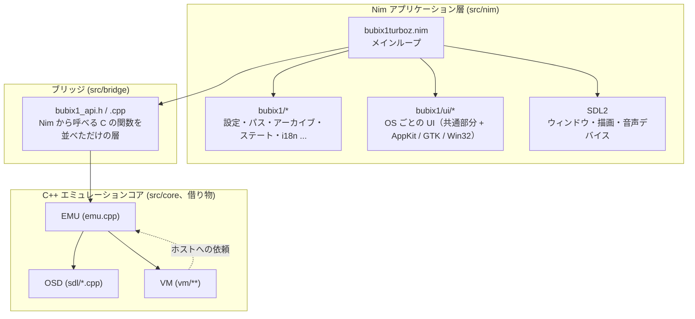
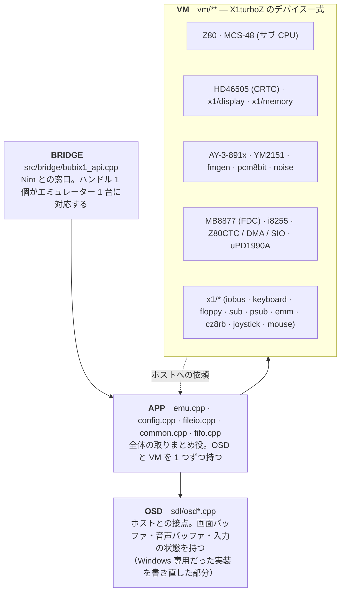
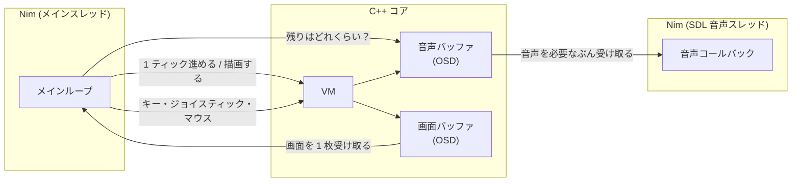
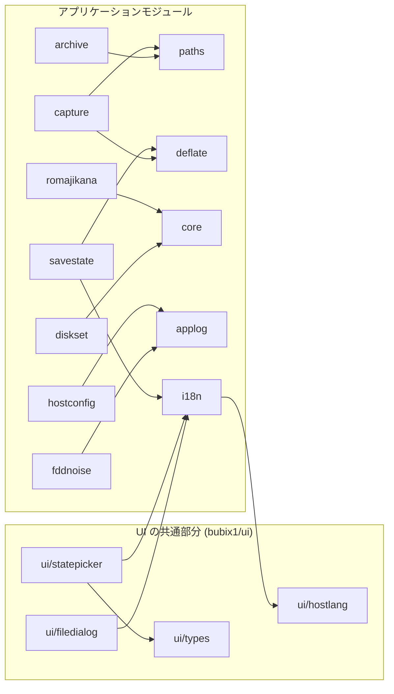
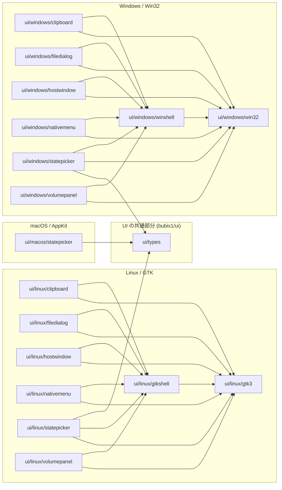

# アーキテクチャ

BubiX1turboZ がどんな部品でできているかを、図で説明します。

このうちコア側の図は手で描いたものです。C++ のコアは他のプロジェクトからそのまま借りて
いるので、自動生成の対象にしていません。Nim 側の依存グラフのほうは
`scripts/make_dep_graph.sh` が作ります。マーカーで囲まれた範囲がそれなので、そこは手で
書き換えないでください（次に実行したときに消えます）。

モジュールごとの詳しい説明は [`docs/api/`](api/theindex.html) にあります。

---

## 全体像

このエミュレーターは大きく 3 つに分かれています。

- **C++ のエミュレーションコア** — Common Source Code Project の eX1turboZ をほぼそのまま使っています
- **Nim のアプリケーション層** — ウィンドウ、メニュー、設定、ファイルの読み書きなど、エミュレーション以外のすべて
- **その間をつなぐブリッジ** — Nim から C++ を呼ぶための薄い層



ひとつ紛らわしいところがあります。コアの中に `src/core/sdl/` というディレクトリが
ありますが、**ここに SDL は入っていません**。SDL2 を使っているのは Nim 側だけです。
このディレクトリは元々 Windows 専用だった部分を書き直したもので、名前がそう見えるだけ
です。ビルド時の `-D_USE_SDL` も「Windows の API は使わない」という意味のスイッチで、
SDL を使うという意味ではありません。

C++ と Nim の間でやり取りするのは、数値とメモリのアドレスだけです。オブジェクトや
複雑な型は渡しません。そのぶんブリッジは薄く、追いかけやすくなっています。

## コア側のつくり

コアは 4 つのグループに分けてビルドしています（`scripts/build_core.sh` にその一覧が
あります）。最終的にはすべて `build/libbubix1core.a` という 1 つのライブラリになります。



VM の中のデバイス（Z80 や FDC など）が画面や音といったホスト側の機能を使いたくなったとき
は、直接 OSD を呼ぶのではなく、いったん EMU に頼みます。EMU がそれを OSD に渡します。
VM から OSD を直接触っているのは、デバッガまわりの 2 か所だけです。

コアには原則として手を入れません。どうしても直す必要があるものは `patches/` にパッチ
として置き、`scripts/apply_core_patches.sh` で当てます。コアを上流から取り込み直すと
パッチは消えてしまうので、そのときは忘れずに当て直してください。

なお、コアのソースにはコメントに Shift-JIS が混ざったファイルがあります。macOS の
`grep` はこういうファイルを何も言わずに読み飛ばすことがあるので、検索結果が空でも
「本当に無い」とは限りません。

## ホストとコアの間で何がやり取りされるか

エミュレーションを進めるペースは、**音声バッファにどれだけ残っているか**で決めています。

素直に作るなら「1 秒間に 60 回 VM を進める」としたいところですが、それだと音が途切れたり
速く進みすぎたりします。そこで、音声バッファの残りが目標より少ないときだけ VM を進める、
という形にしました。SDL の音声スレッドが実時間どおりにバッファを消費していくので、
結果として実時間に合った速度に落ち着きます。



VM を複数のスレッドから同時に触らないよう、`bx1_lock` / `bx1_unlock` で守っています。
EMU 自身も内部で同じロックを取るので、同じスレッドから二重にロックできる種類
（再帰ミューテックス）にしてあります。

## Nim 側のモジュールのつながり

ここからの 4 枚は `scripts/make_dep_graph.sh` が自動で作ったものです。図の中のラベルは、
`bubix1/` を省いたモジュール名です。

矢印は全部で 84 本あり、1 枚に詰め込むと読めないので、4 つに分けました。

もうひとつ。Nim では `when defined(...)` で選ばれなかったほうはコンパイルされません。
そのため 1 回グラフを作っただけでは、そのとき動かした OS のバックエンドしか出てきません。
そこで macOS・Linux・Windows の 3 回ぶんを作って重ね合わせています。3 枚目に 4 つの
バックエンドが並んで見えますが、**実際に動くのはそのうち 1 つだけです**。

<!-- BEGIN GENERATED: module-graph -->

### 本体が直接使っているモジュール

```mermaid
flowchart TD
    bubix1turboz["bubix1turboz"]
  subgraph app["アプリケーションモジュール"]
    bubix1_ankfont["ankfont"]
    bubix1_applog["applog"]
    bubix1_archive["archive"]
    bubix1_capture["capture"]
    bubix1_core["core"]
    bubix1_deflate["deflate"]
    bubix1_diskset["diskset"]
    bubix1_fddnoise["fddnoise"]
    bubix1_hostconfig["hostconfig"]
    bubix1_i18n["i18n"]
    bubix1_keymap["keymap"]
    bubix1_paths["paths"]
    bubix1_recentfiles["recentfiles"]
    bubix1_romajikana["romajikana"]
    bubix1_savestate["savestate"]
  end
  subgraph facade["UI の共通部分 (bubix1/ui)"]
    bubix1_ui_clipboard["ui/clipboard"]
    bubix1_ui_filedialog["ui/filedialog"]
    bubix1_ui_hostwindow["ui/hostwindow"]
    bubix1_ui_nativemenu["ui/nativemenu"]
    bubix1_ui_statepicker["ui/statepicker"]
    bubix1_ui_volumepanel["ui/volumepanel"]
  end
  bubix1turboz --> bubix1_ankfont
  bubix1turboz --> bubix1_applog
  bubix1turboz --> bubix1_archive
  bubix1turboz --> bubix1_capture
  bubix1turboz --> bubix1_core
  bubix1turboz --> bubix1_deflate
  bubix1turboz --> bubix1_diskset
  bubix1turboz --> bubix1_fddnoise
  bubix1turboz --> bubix1_hostconfig
  bubix1turboz --> bubix1_i18n
  bubix1turboz --> bubix1_keymap
  bubix1turboz --> bubix1_paths
  bubix1turboz --> bubix1_recentfiles
  bubix1turboz --> bubix1_romajikana
  bubix1turboz --> bubix1_savestate
  bubix1turboz --> bubix1_ui_clipboard
  bubix1turboz --> bubix1_ui_filedialog
  bubix1turboz --> bubix1_ui_hostwindow
  bubix1turboz --> bubix1_ui_nativemenu
  bubix1turboz --> bubix1_ui_statepicker
  bubix1turboz --> bubix1_ui_volumepanel
```



### モジュールどうしのつながり



### UI が OS ごとに切り替わるしくみ

```mermaid
flowchart LR
  subgraph facade["UI の共通部分 (bubix1/ui)"]
    bubix1_ui_clipboard["ui/clipboard"]
    bubix1_ui_filedialog["ui/filedialog"]
    bubix1_ui_hostlang["ui/hostlang"]
    bubix1_ui_hostwindow["ui/hostwindow"]
    bubix1_ui_nativemenu["ui/nativemenu"]
    bubix1_ui_statepicker["ui/statepicker"]
    bubix1_ui_volumepanel["ui/volumepanel"]
  end
  subgraph macos["macOS / AppKit"]
    bubix1_ui_macos_clipboard["ui/macos/clipboard"]
    bubix1_ui_macos_filedialog["ui/macos/filedialog"]
    bubix1_ui_macos_hostlang["ui/macos/hostlang"]
    bubix1_ui_macos_nativemenu["ui/macos/nativemenu"]
    bubix1_ui_macos_statepicker["ui/macos/statepicker"]
    bubix1_ui_macos_volumepanel["ui/macos/volumepanel"]
  end
  subgraph linux["Linux / GTK"]
    bubix1_ui_linux_clipboard["ui/linux/clipboard"]
    bubix1_ui_linux_filedialog["ui/linux/filedialog"]
    bubix1_ui_linux_hostlang["ui/linux/hostlang"]
    bubix1_ui_linux_hostwindow["ui/linux/hostwindow"]
    bubix1_ui_linux_nativemenu["ui/linux/nativemenu"]
    bubix1_ui_linux_statepicker["ui/linux/statepicker"]
    bubix1_ui_linux_volumepanel["ui/linux/volumepanel"]
  end
  subgraph windows["Windows / Win32"]
    bubix1_ui_windows_clipboard["ui/windows/clipboard"]
    bubix1_ui_windows_filedialog["ui/windows/filedialog"]
    bubix1_ui_windows_hostlang["ui/windows/hostlang"]
    bubix1_ui_windows_hostwindow["ui/windows/hostwindow"]
    bubix1_ui_windows_nativemenu["ui/windows/nativemenu"]
    bubix1_ui_windows_statepicker["ui/windows/statepicker"]
    bubix1_ui_windows_volumepanel["ui/windows/volumepanel"]
  end
  subgraph stub["スタブ (未実装の OS 用)"]
    bubix1_ui_stub_hostwindow["ui/stub/hostwindow"]
  end
  bubix1_ui_clipboard --> bubix1_ui_linux_clipboard
  bubix1_ui_clipboard --> bubix1_ui_macos_clipboard
  bubix1_ui_clipboard --> bubix1_ui_windows_clipboard
  bubix1_ui_filedialog --> bubix1_ui_linux_filedialog
  bubix1_ui_filedialog --> bubix1_ui_macos_filedialog
  bubix1_ui_filedialog --> bubix1_ui_windows_filedialog
  bubix1_ui_hostlang --> bubix1_ui_linux_hostlang
  bubix1_ui_hostlang --> bubix1_ui_macos_hostlang
  bubix1_ui_hostlang --> bubix1_ui_windows_hostlang
  bubix1_ui_hostwindow --> bubix1_ui_linux_hostwindow
  bubix1_ui_hostwindow --> bubix1_ui_stub_hostwindow
  bubix1_ui_hostwindow --> bubix1_ui_windows_hostwindow
  bubix1_ui_nativemenu --> bubix1_ui_linux_nativemenu
  bubix1_ui_nativemenu --> bubix1_ui_macos_nativemenu
  bubix1_ui_nativemenu --> bubix1_ui_windows_nativemenu
  bubix1_ui_statepicker --> bubix1_ui_linux_statepicker
  bubix1_ui_statepicker --> bubix1_ui_macos_statepicker
  bubix1_ui_statepicker --> bubix1_ui_windows_statepicker
  bubix1_ui_volumepanel --> bubix1_ui_linux_volumepanel
  bubix1_ui_volumepanel --> bubix1_ui_macos_volumepanel
  bubix1_ui_volumepanel --> bubix1_ui_windows_volumepanel
```



### OS ごとの実装が使っているもの



<!-- END GENERATED: module-graph -->

## 図を更新する

```
./scripts/make_dep_graph.sh
```

Graphviz は要りません。C コンパイラも SDL も GTK も要らないので、どの OS からでも
3 プラットフォームぶんを作れます。この文書と英語版の `docs/Architecture.en.md` は
同じ実行で更新されます。
